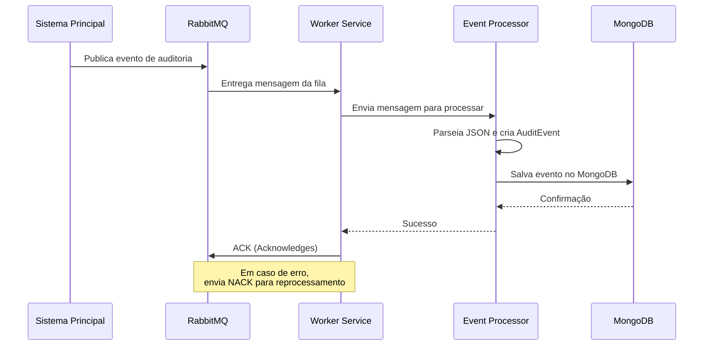

# 📋 FIAP SOAT - Smart Mechanical Workshop - Audit Log

Sistema de auditoria distribuído para rastreamento de eventos de banco de dados em tempo real, desenvolvido como parte do projeto Smart Mechanical Workshop da FIAP SOAT.

## 🎯 Objetivo

Este projeto implementa um **Worker Service** que consome eventos de um sistema através do RabbitMQ e persiste os dados de auditoria em um banco de dados MongoDB, permitindo rastreamento completo de operações realizadas no sistema.

## 🏗️ Arquitetura

```mermaid
graph LR
    A[Sistema Principal] -->|Publica Eventos| B[RabbitMQ]
    B -->|Exchange: database.events.exchange| C[Queue: database.events]
    C -->|Consome Mensagens| D[Audit Log Worker]
    D -->|Processa Eventos| E[Event Processor]
    E -->|Persiste| F[MongoDB]

    style D fill:#4CAF50
    style B fill:#FF6B6B
    style F fill:#4ECDC4
```



### Fluxo de Dados



## 🛠️ Tecnologias Utilizadas

### Framework e Linguagem
- **.NET 10.0** - Framework principal
- **C# 13.0** - Linguagem de programação
- **Worker Service** - Template de aplicação background

### Mensageria
- **RabbitMQ Client 7.2.0** - Cliente para comunicação com RabbitMQ
- **Padrão Exchange/Queue Topic** - Para roteamento flexível de mensagens

### Banco de Dados
- **MongoDB Driver 3.6.0** - Driver oficial do MongoDB para .NET
- **MongoDB** - Banco de dados NoSQL para armazenamento de eventos

### Bibliotecas e Dependências
- **Microsoft.Extensions.Hosting** - Para execução como serviço
- **Microsoft.Extensions.Logging** - Sistema de logging
- **Microsoft.Extensions.Options** - Configuração tipada
- **System.Text.Json** - Serialização/deserialização JSON

## 📁 Estrutura do Projeto

```
src/
└── Fiap.Soat.SmartMechanicalWorkshop.AuditLog.Worker/
    ├── Configuration/          # Classes de configuração
    │   ├── MongoDBConfiguration.cs
    │   └── RabbitMQConfiguration.cs
    ├── Models/                 # Modelos de dados
    │   └── AuditEvent.cs
    ├── Repositories/           # Camada de dados
    │   ├── IAuditLogRepository.cs
    │   └── AuditLogRepository.cs
    ├── Services/               # Camada de serviços
    │   ├── IEventProcessorService.cs
    │   ├── EventProcessorService.cs
    │   ├── IRabbitMqConsumerService.cs
    │   └── RabbitMqConsumerService.cs
    ├── Worker.cs               # Orquestrador principal
    ├── Program.cs              # Ponto de entrada
    └── appsettings.json        # Configurações
```

### Responsabilidades das Camadas

#### **Configuration**
Contém classes que mapeiam as configurações do `appsettings.json` para objetos C# tipados.

#### **Models**
Define o modelo `AuditEvent` que representa um evento de auditoria com propriedades como:
- EventType
- EntityType
- Timestamp
- Data
- Source
- ReceivedAt

#### **Repositories**
Camada de acesso a dados, responsável pela persistência dos eventos no MongoDB.

#### **Services**
- **RabbitMqConsumerService**: Gerencia conexão com RabbitMQ e consumo de mensagens
- **EventProcessorService**: Processa e valida mensagens JSON recebidas

#### **Worker**
Orquestra os serviços, coordenando o fluxo entre consumo de mensagens e persistência.

## ⚙️ Configuração

### appsettings.json

```json
{
  "Logging": {
    "LogLevel": {
      "Default": "Information",
      "Microsoft.Hosting.Lifetime": "Information"
    }
  },
  "RabbitMQ": {
    "HostName": "localhost",
    "Port": 5672,
    "ExchangeName": "database.events.exchange",
    "QueueName": "database.events",
    "UserName": "",
    "Password": ""
  },
  "MongoDB": {
    "ConnectionString": "mongodb://localhost:27017",
    "DatabaseName": "AuditLog",
    "CollectionName": "Events",
    "UserName": "",
    "Password": ""
  }
}
```

## 🚀 Como Executar

### Pré-requisitos

#### Para Docker Compose
- **Docker** e **Docker Compose** instalados
- Arquivo `.env` configurado (copie de `.env.example`)

#### Para Execução Local
- **.NET SDK 10.0** instalado
- **RabbitMQ** rodando (porta 5672)
- **MongoDB** rodando (porta 27017)

### 📦 Configuração Inicial

1. **Copie o arquivo de exemplo de variáveis de ambiente:**
```bash
cp .env.example .env
```

2. **Edite o arquivo `.env` com suas configurações:**
```bash
# Mínimo necessário para desenvolvimento
MONGO_ROOT_USER=root
MONGO_ROOT_PASSWORD=example
RABBITMQ_USER=guest
RABBITMQ_PASSWORD=guest

# Para produção, configure também:
DOCKERHUB_USERNAME=seu-usuario-dockerhub
```

### 🐳 Usando Docker Compose

#### Desenvolvimento (com build local)

Use este comando para desenvolvimento local, onde a imagem do worker será construída a partir do código fonte:

```bash
# Subir todos os serviços (MongoDB, RabbitMQ e Worker)
docker-compose -f docker-compose.dev.yml up -d

# Ver logs do worker
docker-compose -f docker-compose.dev.yml logs -f audit-log-worker

# Parar todos os serviços
docker-compose -f docker-compose.dev.yml down

# Parar e remover volumes (apaga dados do banco)
docker-compose -f docker-compose.dev.yml down -v
```

#### Produção (usando imagem do Docker Hub)

Use este comando para produção, onde a imagem do worker será baixada do Docker Hub:

```bash
# Subir todos os serviços (MongoDB, RabbitMQ e Worker)
docker-compose up -d

# Ver logs do worker
docker-compose logs -f audit-log-worker

# Parar todos os serviços
docker-compose down
```

### 🔌 Acessando os Serviços

Após subir os containers, você pode acessar:

| Serviço | URL | Credenciais |
|---------|-----|-------------|
| **RabbitMQ Management** | http://localhost:15672 | guest / guest |
| **MongoDB** | mongodb://localhost:27017 | root / example |

### 💻 Executando Localmente (sem Docker)

Se preferir executar apenas o worker localmente (com MongoDB e RabbitMQ em Docker):

```bash
# 1. Subir apenas as dependências
docker-compose -f docker-compose.dev.yml up -d mongodb rabbitmq

# 2. Aguarde os serviços ficarem prontos (verificar logs)
docker-compose -f docker-compose.dev.yml logs -f mongodb rabbitmq

# 3. Restaurar dependências
dotnet restore

# 4. Compilar o projeto
dotnet build

# 5. Executar o worker
dotnet run --project src/Fiap.Soat.SmartMechanicalWorkshop.AuditLog.Worker
```

### 🏗️ Build e Push da Imagem Docker

Para construir e publicar a imagem no Docker Hub:

```bash
# Build da imagem
docker build -t ${DOCKERHUB_USERNAME}/smart-mechanical-workshop-audit-log-worker:latest .

# Login no Docker Hub
docker login

# Push da imagem
docker push ${DOCKERHUB_USERNAME}/smart-mechanical-workshop-audit-log-worker:latest
```

### ⚡ Atalhos com Makefile

Para facilitar o desenvolvimento, um Makefile está disponível com comandos úteis:

```bash
# Ver todos os comandos disponíveis
make help

# Desenvolvimento
make dev-up              # Inicia ambiente de desenvolvimento
make dev-down            # Para ambiente de desenvolvimento
make dev-logs            # Ver logs
make dev-logs-worker     # Ver logs apenas do worker
make dev-build           # Rebuild do worker
make dev-restart         # Restart do worker

# Produção
make prod-up             # Inicia ambiente de produção
make prod-down           # Para ambiente de produção

# Build e Deploy
make build VERSION=v1.0.0    # Build da imagem
make push VERSION=v1.0.0     # Push para Docker Hub

# Desenvolvimento Local
make restore             # Restaurar dependências
make compile             # Compilar projeto
make run                 # Executar worker localmente

# Database
make mongo-shell         # Abrir shell do MongoDB
make mongo-backup        # Criar backup do MongoDB

# Utilidades
make ps                  # Ver containers rodando
make health              # Verificar saúde dos serviços
```

## 📊 Formato de Mensagem

O worker espera mensagens no seguinte formato JSON:

```json
{
  "EventType": "Created",
  "EntityType": "Order",
  "Timestamp": "2026-02-20T10:30:00Z",
  "Data": "{\"id\": 123, \"status\": \"pending\"}",
  "Source": "OrderService"
}
```

### Campos

| Campo | Tipo | Obrigatório | Descrição |
|-------|------|-------------|-----------|
| EventType | string | Não | Tipo do evento (Created, Updated, Deleted, etc.) |
| EntityType | string | Não | Tipo da entidade afetada |
| Timestamp | DateTime | Não | Data/hora do evento original |
| Data | string | Não | Dados do evento em formato JSON string |
| Source | string | Não | Origem do evento |

> **Nota**: Todos os campos são opcionais. Campos ausentes receberão valores padrão.

## 🔍 Monitoramento e Logs

O worker utiliza o sistema de logging integrado do .NET. Os logs incluem:

- ✅ Conexão estabelecida com RabbitMQ e MongoDB
- 📨 Mensagens recebidas e processadas
- 💾 Eventos salvos no MongoDB
- ❌ Erros de processamento e rejeição de mensagens

### Exemplo de Logs

```
info: Starting Audit Log Worker
info: Connecting to RabbitMQ: localhost:5672
info: RabbitMQ connection established successfully
info: MongoDB repository initialized for database: AuditLog
info: Worker is now consuming messages from RabbitMQ
info: Message received from RabbitMQ
info: Processing event message
info: Event Created saved to MongoDB successfully
info: Message acknowledged successfully
```

## 🏗️ Padrões de Projeto Utilizados

- **Repository Pattern**: Abstração da camada de dados
- **Service Pattern**: Encapsulamento de lógica de negócio
- **Dependency Injection**: Gerenciamento de dependências
- **Options Pattern**: Configuração tipada
- **Background Service**: Execução contínua em background

## 🧪 Resiliência

O sistema implementa tratamento de erros robusto:

- **ACK/NACK**: Mensagens são confirmadas (ACK) apenas após processamento bem-sucedido
- **Requeue**: Mensagens com erro são reencaminhadas (NACK) para reprocessamento
- **Logging**: Todos os erros são registrados com detalhes
- **Graceful Shutdown**: Encerramento controlado das conexões

---

**FIAP SOAT** - Smart Mechanical Workshop © 2026
